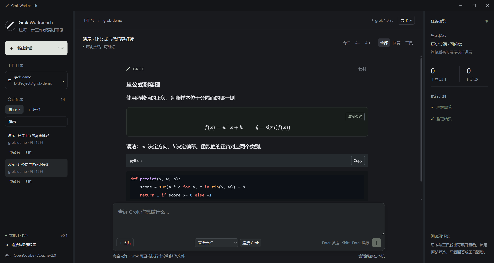
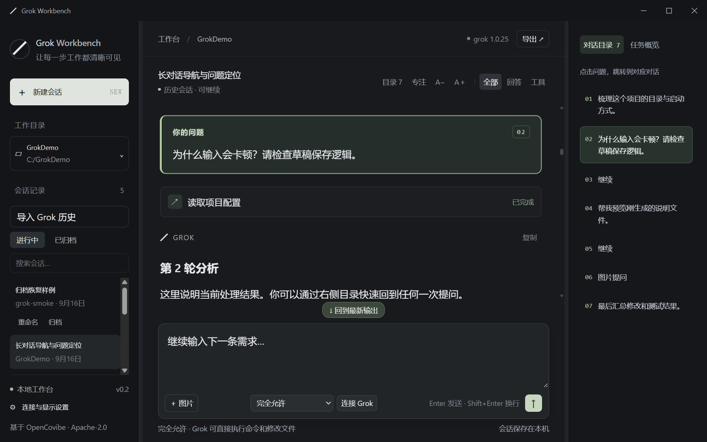
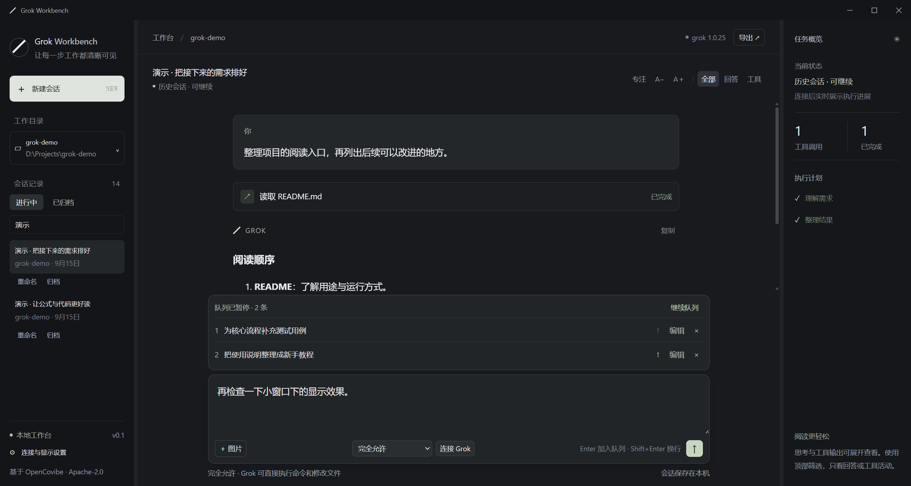
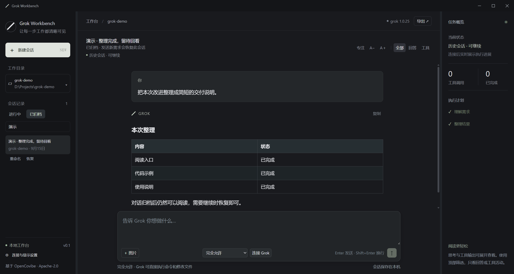

# Grok Workbench

### 让 Grok 的每一步工作，都清晰可见。

为 Grok Build 设计的桌面工作台。阅读流式回答与公式，带图提问，连续安排需求，再把完成的对话归档。

[**下载 Windows 安装包**](https://github.com/cheer932041235/grok-workbench/releases/download/v0.2.4/GrokWorkbench_0.2.4_x64-setup.exe) · [使用指南](docs/guide.md) · [参与贡献](CONTRIBUTING.md) · [反馈问题](https://github.com/cheer932041235/grok-workbench/issues)

**0.2.7 · 早期预览 · Windows x64**。需要单独安装并登录 Grok Build CLI；已联调版本为 1.0.25。



<sub>截图来自实际桌面应用，使用演示对话展示布局。</sub>

## 为连续工作而设计

**看清回答。** Markdown、代码高亮、表格和 LaTeX 公式随输出更新。思考过程与工具详情可以折叠，宽公式和长代码在自己的区域内滚动。

**点开文件。** 点击回答里的本地文件链接或路径，在右侧预览 PDF、图片、视频、Markdown、公式与代码。反引号内的文件路径也能点击；视频支持播放和进度跳转，带行号的链接可定位源码，聊天输入保持可用。相对路径按当前会话工作目录解析；视频编码需受系统 WebView 支持。

**把下一步先写下来。** 回答期间继续输入需求，按顺序排队执行。待执行需求可以编辑、删除、上移，也可以暂停整个队列。

**让对话有去处。** 未归档对话留在左侧。完成后归档，需要时再打开或恢复；每条会话可以重命名，并保存自己的草稿。

| 你想做的事 | 工作台提供的操作 |
| --- | --- |
| 给 Grok 看截图 | 粘贴截图，预览后随需求发送 |
| 读懂公式与代码 | 公式排版、代码高亮、复制源码、调整字号与行距 |
| 追踪执行过程 | 查看工具状态、文件差异和执行计划 |
| 回应 Grok | 在界面提交问题选项、补充文字与计划意见 |
| 提前调整下一轮 | 输出期间预选模型、思考强度和授权模式 |
| 专注当前工作 | 调整两侧面板宽度，筛选回答或工具，切换专注模式 |

### 快速回到每一次提问

右侧目录按问题编号排列，点击即可定位。当前阅读位置与正文提问卡片同步高亮；输出期间也能回看前面的内容。



### 连续安排需求



### 完成后归档，随时回来继续



## 三步开始

1. 按 [Grok Build 官方说明](https://github.com/xai-org/grok-build#installing-the-released-binary) 安装 CLI，在终端运行 `grok` 完成登录。
2. [下载安装包](https://github.com/cheer932041235/grok-workbench/releases/download/v0.2.4/GrokWorkbench_0.2.4_x64-setup.exe)，从开始菜单打开 Grok Workbench。
3. 选择项目文件夹，检查授权模式，发送第一条需求。找不到 CLI 时，在设置中填写 `grok.exe` 的完整路径。

安装版不需要 Node.js 或 Rust。系统缺少 WebView2 时，安装程序需要联网获取运行时。

默认是“完全允许”，Grok 可以执行命令和修改文件；需要逐项确认时改为“默认授权”。

## 开发者入口

前端使用 **Svelte 5 + TypeScript**，桌面层使用 **Tauri 2 + Rust**，通过 ACP 标准输入输出连接本机 Grok CLI。

```sh
git clone https://github.com/cheer932041235/grok-workbench.git
cd grok-workbench
npm ci --ignore-scripts
npm run tauri -- dev
```

需要 Node.js 20+、Rust stable 和 [Tauri 平台依赖](https://v2.tauri.app/start/prerequisites/)。安装细节、构建命令和目录职责见 [开发指南](docs/development.md) 与 [架构说明](docs/architecture.md)。

## 欢迎参与

欢迎提交 PR，也欢迎带着具体使用场景提 Issue。你可以从一个显示问题、一条复现用例、一段使用说明开始。

目前尤其欢迎这些方向：**长会话体验、历史管理、图片与公式显示、Grok 交互回归、跨平台验证**。较大的协议、存储或界面改动，建议先在 Issue 中讨论使用场景和方案，避免做完后才发现方向不一致。

- [贡献指南](CONTRIBUTING.md)：选择任务、准备改动、运行检查、提交 PR。
- [问题反馈](https://github.com/cheer932041235/grok-workbench/issues/new/choose)：报告缺陷或提出功能建议。
- [改进方向](docs/roadmap.md)：当前重点与尚未实现的能力。

## 当前状态

已完成 Windows 上的安装启动、真实 Grok 识图、流式公式、排队执行、提问回传、计划批准和历史归档联调。自动测试包含 39 项前端用例和 7 项 Rust 用例；验证范围见 [测试说明](docs/testing.md)。

仍处于早期预览：同时执行一个会话，支持从本机 Grok CLI/TUI 导入已有会话，历史列表按需读取正文；支持子任务过程显示、刷新和取消。暂不支持通用文件附件或 Mermaid，也不提供手动创建/恢复子任务的独立入口。macOS、Linux 暂未提供经过验证的安装包。

## 文档导航

| 文档 | 内容 |
| --- | --- |
| [使用指南](docs/guide.md) | 安装、图片、排队、归档与常见问题 |
| [开发指南](docs/development.md) | 环境、目录、测试和打包 |
| [历史与子任务方案](docs/history-and-agents.md) | 存储、导入、事件分流与验收要求 |
| [架构说明](docs/architecture.md) | 会话、队列、渲染与 Rust 桥接的职责 |
| [贡献指南](CONTRIBUTING.md) | Issue、PR 与协作约定 |
| [更新记录](CHANGELOG.md) | 已发布版本 |

作者与维护者：[疏锦行](https://github.com/cheer932041235)。

### 检查更新

在“连接与显示设置 → 应用更新”点击 **检查更新**，即可查询 GitHub 最新发布（含预览版）。发现新版后，点击 **前往下载新版** 在系统浏览器中下载安装包，由你选择安装时机。查询更新不会中断正在进行的 Grok 对话。
