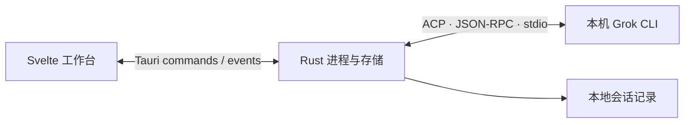

# 架构与逻辑入口

[返回首页](../README.md) · [开发指南](development.md)

## 三层职责

界面组织会话、队列和渲染。Rust 启停 CLI、桥接标准输入输出、保存记录。Grok CLI 负责登录、模型请求和工具执行。

## 一条需求的路径

1. `+page.svelte` 取得文本与图片，交给 `PromptQueue`。
2. `queue.ts` 保证同一时刻只执行一条，后续需求保持顺序。
3. 页面连接 CLI，应用待生效的设置，再发送 `session/prompt`。
4. `client.ts` 关联请求与响应，接收 Rust 转发的更新事件。
5. `protocol.ts` 将文本、工具和计划更新合并到当前记录，组件重新渲染。
6. 当前任务结束后保存记录，队列继续；失败或停止时队列暂停。

图片通过 `images.ts` 转为 ACP 图片内容，跟随对应队列项传递。公式通过 `math.ts` 在 Markdown 消耗反斜杠前解析，由 KaTeX 排版。

## 模块地图

| 模块 | 负责什么 |
| --- | --- |
| `src/routes/+page.svelte` | 会话状态、设置、历史管理与组件协调 |
| `src/grok/client.ts` | JSON-RPC 请求响应、事件监听与连接代次 |
| `src/grok/protocol.ts` | 会话数据类型、更新合并、工具文本 |
| `src/grok/queue.ts` | 串行执行、编辑、暂停和恢复 |
| `src/grok/interactions.ts` | 提问与计划响应数据 |
| `src/grok/images.ts` | 图片读取、预览地址与协议内容 |
| `src/grok/math.ts` | 行内和独立公式解析 |
| `src/grok/*Card.svelte` | 工具与用户交互卡片 |
| `src/grok/RichText.svelte` | 富文本和复制交互 |
| `src/grok/TitleBar.svelte`、`PanelResize.svelte` | 窗口操作与侧栏宽度 |
| `src-tauri/src/grok.rs` | CLI 生命周期、消息桥接、历史读写 |

## 历史与恢复

会话保存在应用数据目录的 `sessions/`，包含正文、计划、草稿、排队需求、图片与归档状态。界面偏好和最近会话标识保存在 WebView 本地存储。

归档只改变记录状态。打开历史会话先读取本地内容，继续执行时再请求 CLI 恢复会话。重启恢复的队列保持暂停，由用户决定何时继续。

## 当前需要改进的结构

页面协调逻辑仍较集中；历史接口一次读取全文；保存直接写入文件，单个文件解析错误可能影响列表。后续优先围绕这些实际问题拆分职责、改善读取和保存，而不是同时重写全部模块。

本说明描述当前实现，不代表已支持多会话并行或跨平台验证。
